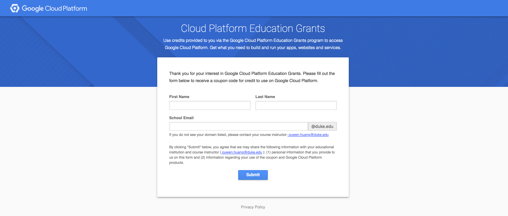
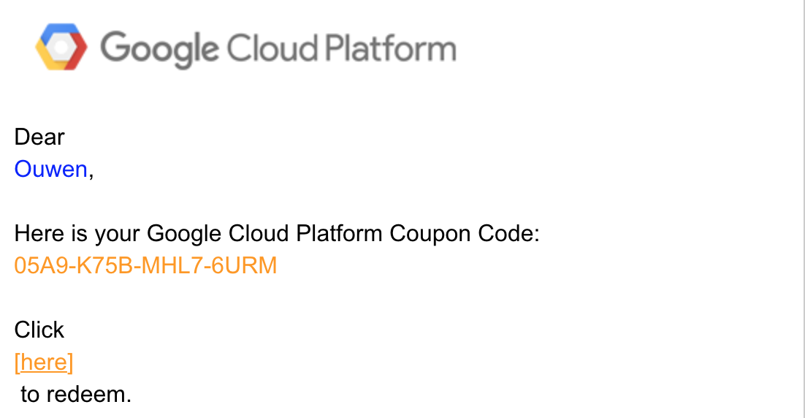
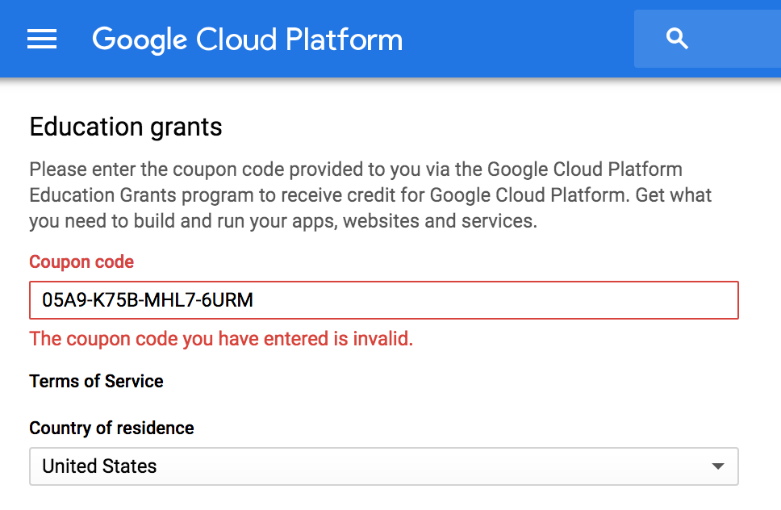
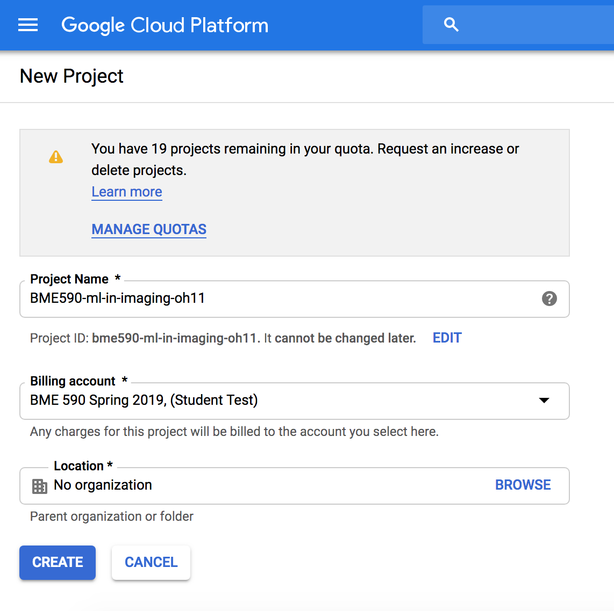

# Getting setup with Google Cloud Platform.

### 1. Go to the following link: [Higher Education Grants - Google Cloud Platform](https://urldefense.proofpoint.com/v2/url?u=https-3A__google.secure.force.com_GCPEDU-3Fcid-3DL5coc3IsY-252BAzvZwfHGS3tFSvTz4wQXc8TQs7ZOvU-252BJh3lwMo8veKfLd0VG4G2XZa&d=DwMFaQ&c=imBPVzF25OnBgGmVOlcsiEgHoG1i6YHLR0Sj_gZ4adc&r=KMCMrYJ8MLVP7SV2R0Re2oyNHKJT-kpYGmdF8cXxJSw&m=cYuFhqDBq84RXUAfnEwHy4gLa_0kXXf4-1rMbPy2LNs&s=NT37P_zTqjpEDHDZf-rcG1Uyp4iSQKMcaP69hfygUIk&e=). This will provide you \$100 in google cloud credits.


Enter your name and Duke Email to redeem your credits. If you run out of credits this can be extended.

### 2. You should recieve an email to redeem the credits. Click and redeem (your credits should be valid)


You should have the opportunity to create a billing account name. You can use: `BME 590 Spring 2019 (<your_netid>)`


### 3. Create a new project from the google console. This can be accessed by going to [Google Cloud Platform](https://console.cloud.google.com/).

Use the Project name:
`BME590-ml-in-imaging-<your_netid>`
Do not choose an organization. Hit create, and google will take a few seconds to get things setup.


### 4. Go to the VPC settings and add firewall settings exposing the following ports.
 - 8888 for jupyter notebooks
 - 6006 for tensorboard (later)
 - 3000 for general web apps
 - 9000 for general web apps
 
Video here: [Firewall settings](https://youtu.be/Fv7TdXEud9E)

### 5. Create a VM based on an existing image from Google. For now, you do not need an expensive GPU, just go with the lowest settings. In the future you can create a machine with a GPU on your own.
Video instructions here: [Create VM](https://youtu.be/aVlWF-21JWg)


### 6. Update your VM so that you have a static external IP address.
Video instructions here: [Static IP + Cloud Storage](https://youtu.be/KT9DD7cqjQo)


### 7. Use the google cloud web ssh into your new machine and run the following commands:
```bash
git clone https://github.com/Ouwen/BME-590-Machine-Learning-in-Imaging
cd ./BME-590-Machine-Learning-in-Imaging
screen -S notebook_server
```
With the `screen` command you enter a new virtual screen. Start `jupyter` in this new virtual screen.
```bash
jupyter notebook --ip=0.0.0.0

# After running some logs should appear, the important piece is your login token.

http://(tensorflow-1-vm or 127.0.0.1):8888/?token=3fcbf5c93f80a320f3b691b5d741f95b5b9756d64b86150a

# Copy the token "3fcbf..." and save it somewhere secret.
```
Video Instructions here: [SSH to your server and start jupyter](https://youtu.be/VZKZQ5wNagw)

**Not shown in the video but important**: You should exit the `screen` by pressing `Ctrl + A + D`. It will run in the background of your VM if you leave it on. If you ever need to go to the jupyter server terminal just resume the screen you made with.
```bash
screen -r notebook_server
```

### 8. If you stop your instance, your programs will also stop. So to restart the server you need to run step 7 again starting from `screen`. When your server is running, you can access the notebook from anywhere, another computer, a chromebook, ipad, or even your phone.

___________
## Important, if you leave your server running it will cost money. The server we spun up is not very expensive, but with GPUs the cost can be up to \$300 a month.
